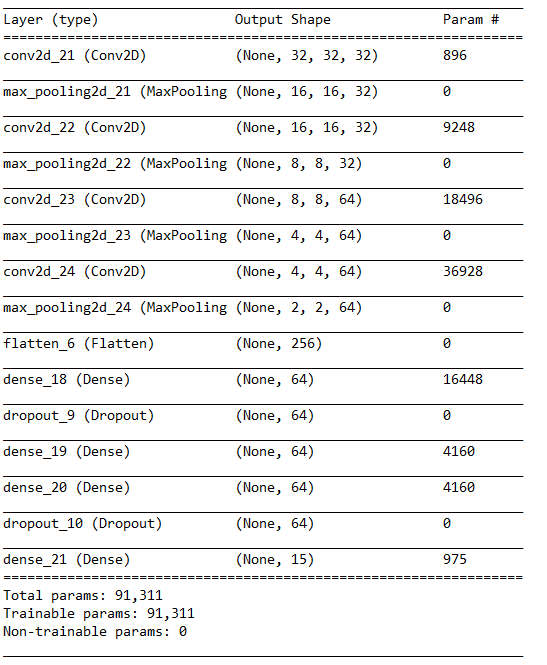

# Caavo Computer Vision Challenge - HackerEarth

------


##### This repo contains codes for the [Caavo](https://caavo.com/) [Computer Vision Challenge](https://www.hackerearth.com/challenge/hiring/caavo-software-engineer-hiring-challenge/?utm_source=challenges-modern&utm_campaign=participated-challenges&utm_medium=right-panel) organized on [HackerEarth](https://www.hackerearth.com/).

I have implemented the image classification using CNN with 3 Convolutional layer. The dataset consists of images of different fashion clothing. The train set has 62258 images from 15 different categories and the test set consists of 21273 images.

Task: To classify each image in the test set as one of the given 15 categories of clothes.


Folder Structure:

```
​```bash
├── Caavo Computer Vision Challenge
│   ├── dataset
│   │   ├── training_set
│   │   │   ├── 15 catergories (directories) 
|   │   ├── test_set
│   │   │   ├── 15 catergories (directories) 
|   │   ├── test
│   ├── sample_submission.csv
│   ├── model
│   │   ├── 
│   └── partials/template
├── train_test_split.py
├── train.py
├── predict.py
├── submission.py
├── mode_architecture.png
├── README.md
└── .gitignore
​```
```


###Requirements:

1. Tensorflow (>1.0)
2. Keras (>1.0)
3. Python (>3.5)
4. Anaconda (Recommended)


### CNN Architecture




### Run 

1. Clone the repo.
2. Download and extract the dataset and extract it to ``dataset/``.
3. Open terminal or Anaconda (recommended) and run `python train_test_split.py`.
4. Run `python train.py` to train the model on image dataset.
5. Grab a cup of coffee and take a small nap while the model trains!
6. Run `python predict.py` for prediction on test set.
7. Sit back and let the code do the **magic**....


### Output

I was able to get an accuracy of 94% on train set and 93.5% on validation set. I just ran the model for 10 epochs. There is still plenty of room for improvement. Feel free to clone the repo or fork it and and tune the hyper-parameters to get better results.


### Further Works that I think can improve the model's accuracy

1. Hyper Parameter Tuning
2. Data Augmentation
3. More epochs = More training = Better Accuracy (may be)
4. Batch Normalization
5. Using a better optimizer function
6. Using pre-trained models like [VGG16](https://keras.io/applications/#vgg16), [InceptionV3](https://keras.io/applications/#inceptionv3), [InceptionResNetV2](https://keras.io/applications/#inceptionresnetv2)(small size and good accuracy), etc. for feature extraction may increase accuracy.


##### Finally, If liked the repo and found it useful, don't forget to star it!  